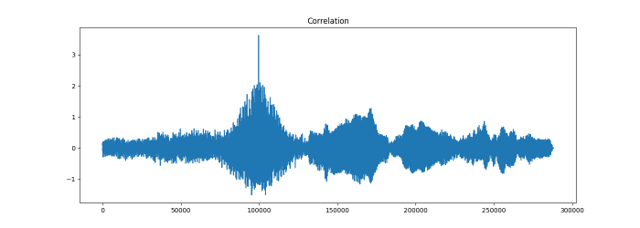
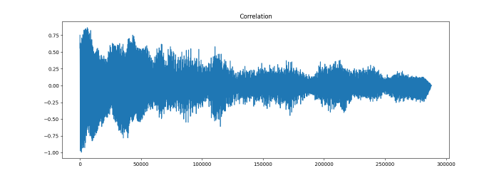
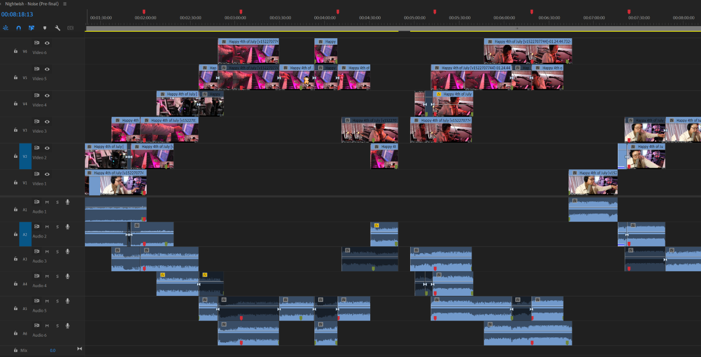

# loopfinder

A little command-line tool that uses mathematical correlation on audio files
for helping to figure out exactly where a looped piece of music starts to
repeat itself, so that you can know the exact length of the loop, which is
almost a requirement for editing Dr. Ong highlights. The loopfinder can
optionally provide a marker file for import into editing software to
automatically mark the loops for editing.

Far from perfect, but usually saves time on squinting at waveforms trying
to find the exact spot where they line up.


## Installing

The loopfinder is a python script, so requires python (probably anything 3.7 or
newer will work). You'll also need the librosa, numpy, scipy, and matplotlib
libraries installed (cheatsheet: `pip3 install librosa numpy scipy matplotlib`
or `pip3 install -r requirements.txt`). You may also need `ffmpeg` installed
somewhere in your path, for reading certain file types.

On linux & mac, you should just be able to drop the script into `/usr/local/bin`
or `~/bin` or wherever and call it by name; on windows you'll probably need to
do something like `py -3 c:\some\path\loopfinder.py`, or make yourself a 2-line
bat script to do the same.

If someone were to request a `pip install`-able version of this tool, that
could probably be made to happen.


## Definitions

A couple of definitions for terms we'll (try to) use consistently here:

<!-- be sure to keep the spaces at the end of the lines here, to get formatting -->
**source audio**  
The raw audio file, as read from the audio or video file
provided on the command line.

**correlation source** or **source segment**  
The segment of audio, usually from
the beginning of the first layer of a loop, that will be used as the 'template'
to find where the loop starts to repeat. The source segment is determined by
a combination of the `--start` and `--window` options (see below)

**correlation target** or **target segment**  
  The segment of audio that the
correlator will search in an attempt to find where a loop repeats. The target
segment is determined by a combination of the `--search-at` and `--window`
options, where the target segment will start at the timestamp provided by
the `--search-at` option, and will be as long as 4 times the `--window` option.


## Usage

loopfinder can extract the audio from a video file directly, so you can just
run it against the same file you're going to be editing. Wherever a time offset
is needed, you can use either `HH:MM:SS.sss` format, or just decimal seconds
(`SS.sss`). The only exception to this is the window size, which must be an
integer number of seconds (for now)

<!-- be sure to keep the spaces at the end of the lines here, to get formatting -->
`--start OFFSET`  
The time offset, into the source audio, for the audio that will be used as the
correlation *source*. This is generally audio near the beginning of the first
pass through the loop.

`--window SECONDS`  
The length of audio to use (starting at the offset from the `--start` option)
to use for the correlation source. Usually 2 or 3 seconds will suffice.

`--search-at OFFSET`  
The time offset, into the source audio, of the correlation *target*, where
the search will begin. The audio used as the correlation target will start
at the specified timestamp, and continue for a length of 4 times the window
size. e.g. with a window size of `2` and a search offset of `00:49.0`, the
audio range to be searched will start at `00:49.0` and end at `00:57.0`. At
the moment this offset needs to be *before* the repeated audio that you are
trying to match against, but fairly close. You should be able to identify an
appropriate offset by ear with no real effort.

When you run the loopfinder command, it will do its magic, reading in the
correlation source audio, comparing it to the correlation target audio, and
finding the location that has the best correlation. Once this has been done,
it will print out some technical info, show you a pretty graph (more on
that in a moment), and finally print the vital information about the length
of the loop.

The technical information is provided as a way to help judge the quality of
the match -- there's always *some* correlation between signals, so there's
no way to say "it definitely worked!" or "it definitely failed". I (Alinsa)
haven't been able to come up with some set of criteria that definitively
shows whether the correlation was good or bad, so that determination is
somewhat left as an exercise for the reader.

*In general*, a good correlation will have a peak over 3.0, an average
difference of less than 100, and a prominence over 5. Some of these
can still be in this range even for a bad correlation, though, so takes
some judgement. Good correlations always seem to be obvious on the graphs,
though.

Speaking of graphs! Assuming you have a matplotlib backend installed (which
is (probably) the default on most matplotlib installs), loopfinder will pop
up a graph after doing the correlation, and the shape of the graph usually
makes it very easy to determine the quality of the correlation. A good
correlation will tend to have one distinct high spike with a bell curve to
either side of it; a poor correlation tends to just be a big blob of data
with no real obvious spikes, or sometimes a ton of obvious spikes.

### example 1: good correlation



### example: bad correlation




## A full example

Included in the repository is `loopfinder-example-babylon-5.mp4`, which is the
first few minutes of a recent Ong request (with video of horrific quality
because it doesn't matter for this exercise). If you load this file up into
your favorite editor, you should be able to play it back and find the start of
the loop, and the point at which the loop starts to repeat.

On the example file, by my ear, the start of the loop is 29.9 seconds in,
and starts to repeat right after the 2 minutes 7 seconds point (which makes
it a pretty long loop!). Using that information, you can run the loopfinder:

```bash
$ loopfinder.py --start 29.9 --search_at 2:07 --window 3 loopfinder-example-babylon-5.mp4
Found! 99675 samples (2.077s) from search offset 127.0s
       peak corr. 3.620, avg diff. 39.346, prominence 5.123

Loop start:  29.900s
Loop end:    129.077s
Loop length: 99.177s
```

This solution has a peak correlation of over 3, an average difference of less
than 100, and a prominence of over 5, so it is probably a good correlation.
A look at the graph (which happens to be the "example 1" graph, above) shows
that this is, indeed, a good correlation.

An exercise for the reader: Run the same example, but with a `search_at` that
won't correlate well (try, for example, `2:17`), and observe what the
correlation metrics and the graph for that poor correlation look like.


## Hints and Extras

* The `start` time doesn't need to be at exactly the beginning of the loop.
Frequently Jon will overlap his playing slightly at the end of the loop (so
that the end of the loop and the beginning of the loop will flow together),
and that overlap hurts the correlation. Sometimes shifting your 'start' time
forward by half a second or so helps.
* Jon usually starts talking pretty soon after the first layer is recorded to
the looper. Make sure that he doesn't start talking in the window you're trying
to correlate in, since that will break the correlation. Shorten the `--window`
time if needed to accomodate this, or in extreme cases, pick some new segments
of audio elsewhere in the loop.
* You don't *need* to use the start of the loop for your correlation, nor the
first layer of the loop, it is simply convenient. You can use *any* values for
`--start` and `--search_at` as long as both times contain the same audio data
(e.g. are played back from the same place in the loop without extra audio
being added) and are basically one loop's length apart.
* If you want the timestamps in the output (and the marker data, if you ask for
it (see below)) to still be correct when you don't use the start of the loop
as your `--start` value, you can specify the timestamp for the *actual* start
of the loop with the `--realstart` option, which will adjust the displayed
timestamps appropriately. (the loop length itself won't change)
* If you don't want to stare at the pretty graph, `--no-graph` is your friend.


## Markers

If you use Adobe Premiere (other formats on request, if your editor can import
marker info), you can request that a set of markers be generated for you,
using the `--markers` command-line option. When specified, you get a chunk of
data:

```csv
29.900000,29.900000,1,segmentation,Loop_1
129.077000,129.077000,1,segmentation,Loop_2
228.254000,228.254000,1,segmentation,Loop_3
[etc]
```

This can be cut & pasted into a modified version of the free "Markerbox"
extension for Premiere (ask Alinsa for it), which will turn that chunk of
data into markers for both the video clip itself, and for the sequence as
a whole, shown here in use partially through an edit:



Once mark(er)ed this way (before you begin editing), as long as the markers
on the clips are kept aligned with one of the markers on the sequence (and
Premiere is helpful by making them able to be snapped to) you can edit at
will and everything will cut together cleanly. It's like magic!


## Disclaimers

* Alinsa's math skills went away decades ago. All this math stuff could be
really poorly done. Patches welcome.
* This works for Alinsa. If it doesn't work for you, and you want it to,
please poke at her to try to fix things.
